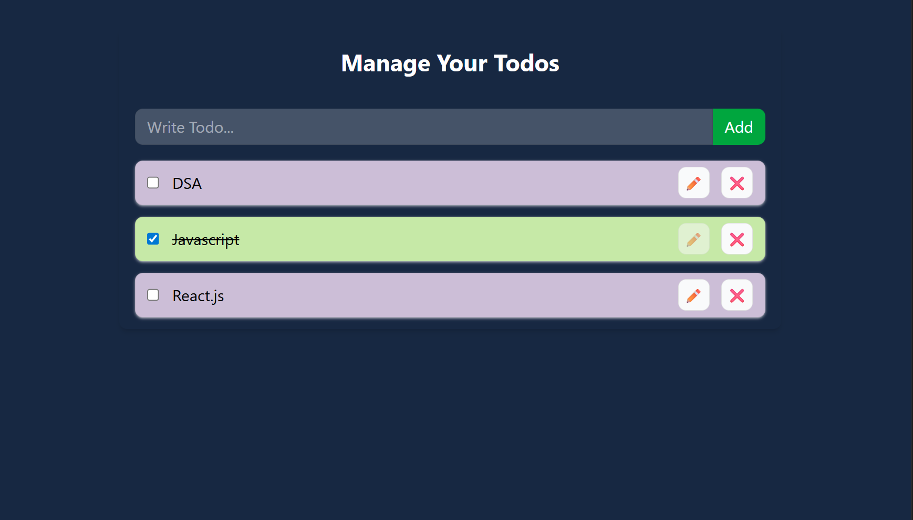

# 📝 Todo App

A modern and responsive **Todo Application** built with **React.js**, **Context API**, and **Local Storage**. This project demonstrates global state management using Context API while persisting tasks in the browser using Local Storage.

---

## 📸 Preview

---

## ✨ Features

- ✅ Add new todos
- ✏️ Edit existing todos
- 🗑️ Delete todos
- ✔️ Mark todos as completed
- 💾 Persistent storage using Local Storage
- 🌐 Global state management with Context API
- 📱 Responsive UI
- ⚡ Fast and lightweight
- 🎨 Clean modern design

---

## 🛠️ Tech Stack

- React.js
- Context API
- JavaScript (ES6+)
- Tailwind CSS
- Local Storage
- Vite

---

## 📖 Learning Outcomes

This project helps you understand:

- React Context API
- State Management
- useContext Hook
- useState Hook
- useEffect Hook
- Local Storage API
- Component-Based Architecture
- CRUD Operations in React

---

## 👨‍💻 Author

**Abhishek Singh**

- GitHub: https://github.com/isinghabhii
- LinkedIn: https://linkedin.com/in/isinghabhii

---

## ⭐ Support

If you found this project helpful, consider giving it a ⭐ on GitHub.

Happy Coding! 🚀
